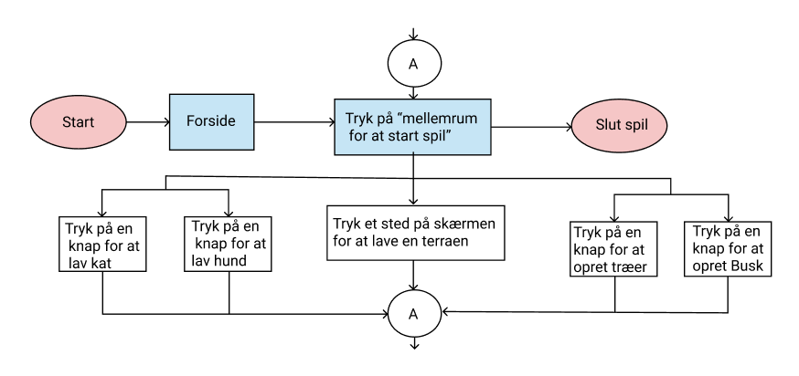
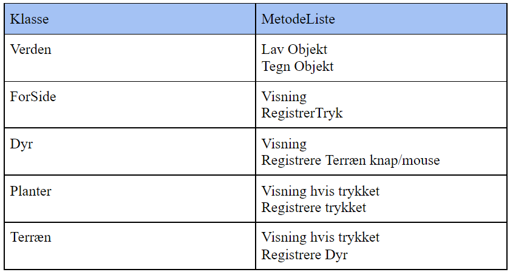
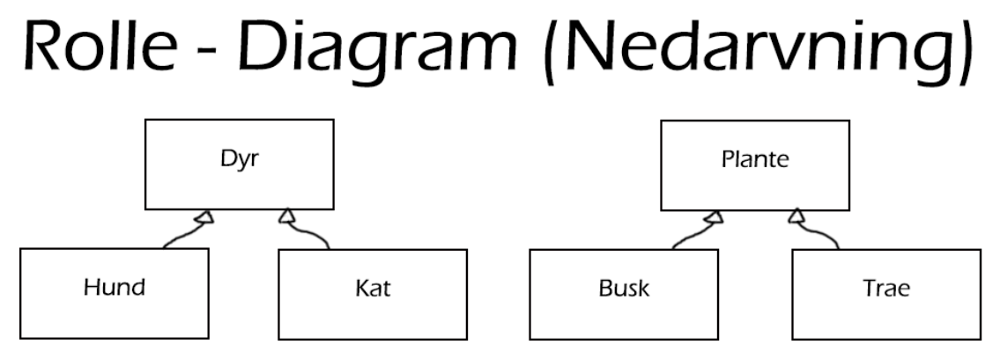
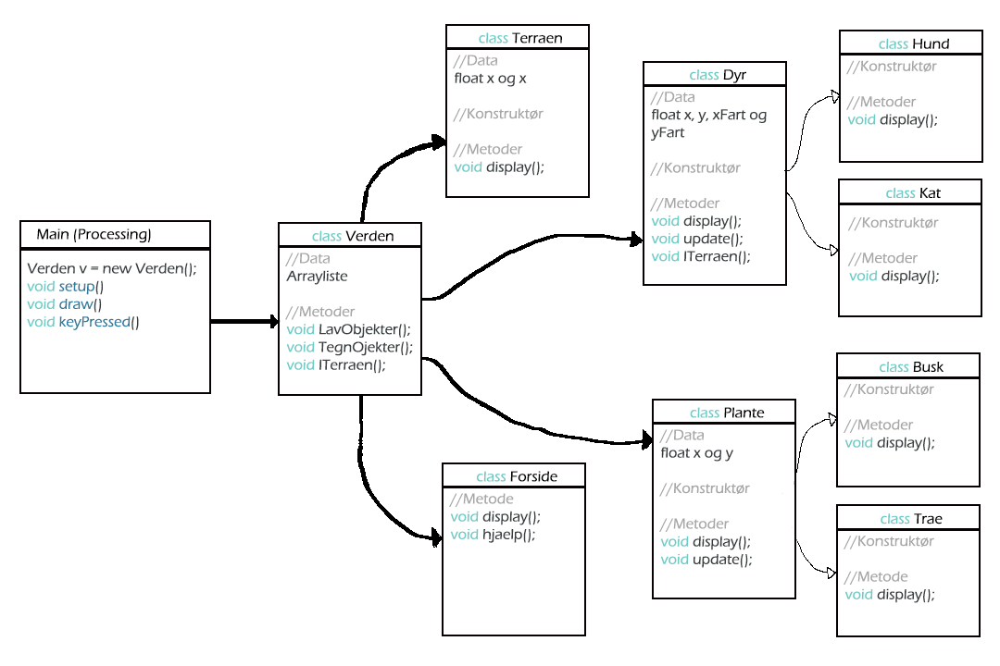

# Prog2D
Udarbejdet af Victor og Zaid Kerm/it, 2.i

Arbejdet blev fordelt jævn mellem gruppemedlemer ift. OOAD og programmering. 

<h2> OOAD </h2>
OOAD står for Objektorienteret analyse og design og består af fem trin, den første trin handler om krav til produktet. Derefter kommer man til den anden trin, som omhandler Analyse, hvor man ser på hvordan programmet virker. Derefter kommer man videre til den tredje trin, som handler om hvordan programmet kode skal se ud ift. klasser og metoder. Efter det kan man så begynde med at kode og derefter teste ens program.

<h3>Krav: </h3>

Der arbejdes første med krav til produktet: 

 	Produktet skal indholde objektorienteret kode. 

 	Spillet skal være et 2D spil. 

	Der skal mindste være to typer “Planter”, som skal kunne vokse

 	Der skal ogsp mindste to typer “dyr”, som kan bevæge sig.
	
	Der skal være en type terræn, som påvirker dyr.
		
	Derudover skal der være simpelt og letlæseligt kode.

<h3>Analyse: </h3>

**Beskrivelse liste**
Første laves der Ting/Beskrivelse liste, her laves der en liste som beskriver, hvad programmet skal indholde:

    Forside         En forside som vil indholde knapperne Spil og hjælp.
    
    Hjælp knap	Fortæller hvilke knapper gør hvad.
    
    Spil knap 	Lukker menuen og aktivere knapper til funktionerne.
    
    Dyr		Kan bevæge sig tilfældigt rundt på hele skærmen.
    
    Planter		Kan ikke bevæge sig, men kan vokse.
    
    Terræn		Område der kan nedsætte et dyrs bevægelseshastighed.

Udfra Beskrivelse liste laves der en flowchart over opgaven:

<h3>Design</h3>
**Klasse/Metode liste**

Her bliver der arbjedet med de klasser, samt hvilke metoder som skal bruges til programmet: 

**Rollem diagram**

Under denne model arbjedes der med de classer der gør burge af nedarvning. Pilene er også tomme, som betyder at den "er en" altså burger nedarvning:

**Klassediagram:**

